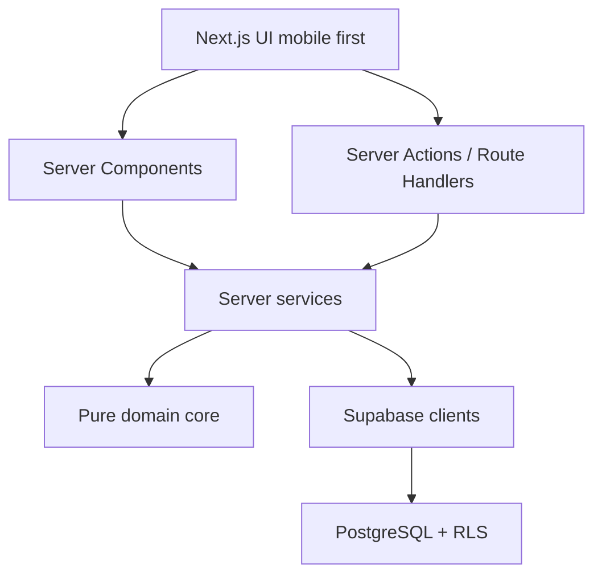

# Arquitetura

## Direção

O Projeto 30 usa Next.js App Router como aplicação web responsiva e Supabase como
plataforma de autenticação, banco, políticas de acesso e storage futuro.

Leituras internas devem acontecer em Server Components sempre que possível. Mutações
sensíveis devem passar por Server Actions ou Route Handlers e chamar serviços de
domínio no servidor.

## Módulos

- `auth`: e-mail/senha, magic link e callback OAuth pronto para expansão.
- `challenges`: cálculo de dia e estrutura de ciclos.
- `journey`: finalização do dia, hábitos, pontos, sequência e conquistas -
  toda a regra de negócio real roda em SQL (`finalize_daily_log_with_responses`,
  ver `supabase/migrations/0037+`), nunca em TypeScript. Os cálculos originais
  de pontos/sequência em TypeScript (`points.core.ts`/`streaks.core.ts`) foram
  a implementação real antes dessa migração para SQL; preservados só como
  documentação histórica em `docs/specs/`, fora de `src/` e fora do build -
  nunca executam em produção.
- `journal` (Diário): reflexões diárias, privadas por RLS - a política de
  leitura é dono-apenas (nenhuma exceção de admin lê o texto; ver ADR
  correspondente e `supabase/migrations/0081_journal_privacy_hardening.sql`).
  Página dedicada em `/app/diario`, serviço em
  `src/server/services/journal.service.ts`.
- `library` (Biblioteca): centro de conteúdo (Corpo/Mente/Caráter/Espírito) em
  `library_contents` + progresso em `library_reading_progress`
  (`supabase/migrations/0083-0084`). Fluxo editorial completo (rascunho →
  revisão → aprovado → publicado/agendado/arquivado) em `/admin/biblioteca`;
  leitura em `/app/biblioteca`. Geração assistida por IA opcional (ver
  `docs/decisions.md`, ADR-011) em `/admin/biblioteca/gerar` - nunca publica
  sozinha.
- `feedback`: relatos/sugestões/avaliações de usuários, com resposta do admin
  fechando o ciclo via notificação (nunca inclui o texto da resposta no
  push).
- `notifications`: motor único de campanhas (`notification_campaigns` +
  `notification_deliveries`, `supabase/migrations/0041+`) para tudo -
  lembretes, campanhas manuais do admin e automações orientadas a evento
  (nova dica, conquista desbloqueada, resposta de feedback). Nunca uma fila
  paralela por feature.
- `sharing`: templates e cards de compartilhamento (conquistas, progresso).
- `admin`: cockpit operacional, gestão de usuários/desafios/dicas/Biblioteca/
  notificações/feedback e Observabilidade, servidos por
  `src/server/services/admin-*.service.ts` e funções SQL `security definer`.
  Detalhes de analytics em `docs/admin-analytics.md`.

## Fronteiras

- O cliente não calcula pontos, sequência ou permissões como fonte de verdade.
- Serviços em `src/server/services` são server-only.
- Núcleos puros em `src/features/*/*.core.ts` existem para teste determinístico e
  devem ser chamados por serviços do servidor.
- Supabase service role só pode ser usada em código server-only.
