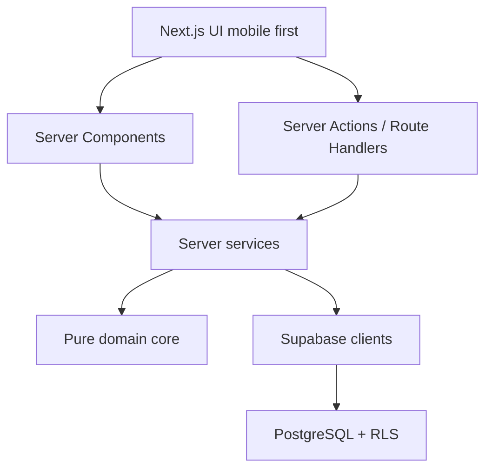

# Arquitetura

## Direção

O Projeto 30 usa Next.js App Router como aplicação web responsiva e Supabase como
plataforma de autenticação, banco, políticas de acesso e storage futuro.

Leituras internas devem acontecer em Server Components sempre que possível. Mutações
sensíveis devem passar por Server Actions ou Route Handlers e chamar serviços de
domínio no servidor.

## Módulos

- `auth`: e-mail/senha, magic link e callback OAuth pronto para expansão.
- `challenges`: cálculo de dia e estrutura de ciclos.
- `points`: cálculo puro de eventos de pontuação e idempotência.
- `streaks`: cálculo puro de sequência.
- `journal`: privado por RLS e sem compartilhamento automático.
- `sharing`: templates e cards preparados para geração 1080 x 1920.
- `admin`: tabelas e políticas para gestão administrativa. A partir da Fase 2, o
  dashboard, o analytics por desafio e a gestão de participantes ficam em
  `src/app/admin/**`, servidos por `src/server/services/admin-analytics.service.ts`
  e pelas funções SQL de `supabase/migrations/0006_admin_analytics.sql`. Detalhes
  em `docs/admin-analytics.md`.

## Fronteiras

- O cliente não calcula pontos, sequência ou permissões como fonte de verdade.
- Serviços em `src/server/services` são server-only.
- Núcleos puros em `src/features/*/*.core.ts` existem para teste determinístico e
  devem ser chamados por serviços do servidor.
- Supabase service role só pode ser usada em código server-only.
