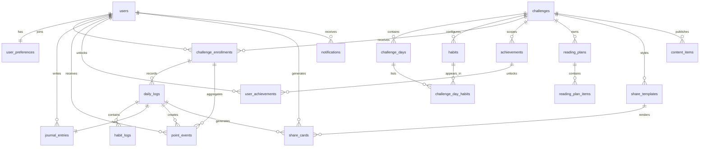

# Banco De Dados

## Modelo inicial



## Tabelas

- `users`
- `user_preferences`
- `challenges`
- `challenge_days`
- `habits`
- `challenge_day_habits`
- `challenge_enrollments`
- `daily_logs`
- `habit_logs`
- `journal_entries`
- `point_events`
- `achievements`
- `user_achievements`
- `reading_plans`
- `reading_plan_items`
- `share_templates`
- `share_cards`
- `content_items`
- `notifications`
- `admin_audit_logs`

## Segurança

RLS está habilitado em todas as tabelas públicas. A política inicial é
conservadora:

- usuários leem apenas os próprios dados;
- diário, logs, pontos, cards e conquistas do usuário são privados;
- desafios ativos, hábitos ativos, plano de leitura publicado, conquistas ativas e
  conteúdo publicado podem ser lidos;
- escritas sensíveis de jornada, pontuação, diário e conquistas ficam reservadas ao
  servidor ou ao administrador;
- administradores usam políticas específicas via `public.is_admin()`.

## Pontuação

`point_events` é o ledger de pontuação. Cada evento tem `idempotency_key` única para
evitar duplicação ao repetir uma finalização ou reprocessamento.

## Ciclos e Histórico

O modelo trata cada participação como uma linha em `challenge_enrollments`. Um usuário
pode participar de desafios diferentes ou voltar ao mesmo desafio em outro momento,
desde que não tenha duas inscrições simultâneas `active` ou `paused` para o mesmo
desafio.

Dados diários e históricos carregam o vínculo com a inscrição e, quando necessário,
com o desafio:

- `daily_logs` valida que o dia pertence ao mesmo desafio da inscrição;
- `habit_logs` valida que o hábito pertence ao dia registrado;
- `journal_entries`, `point_events`, `user_achievements` e `share_cards` validam que
  usuário, inscrição e desafio apontam para o mesmo ciclo;
- conquistas e templates de compartilhamento são escopados ao desafio.

Essa estrutura permite arquivar um desafio, criar outro e preservar o histórico antigo
sem alterar a estrutura do banco.

## Primeiro Administrador

A criação do primeiro administrador não é feita por RPC pública nem pelo cliente.
O fluxo aprovado é:

1. cadastrar o usuário normalmente pelo fluxo de autenticação;
2. abrir o SQL Editor do Supabase;
3. promover manualmente o usuário pelo e-mail cadastrado;
4. conferir que apenas um operador autorizado executou o procedimento.

Use o SQL abaixo substituindo somente o placeholder `ADMIN_EMAIL_AQUI`:

```sql
update public.users
set role = 'admin'::public.user_role,
    updated_at = now()
where id = (
  select id
  from auth.users
  where email = 'ADMIN_EMAIL_AQUI'
);
```

O usuário nunca deve conseguir alterar o próprio `role` pela aplicação.
