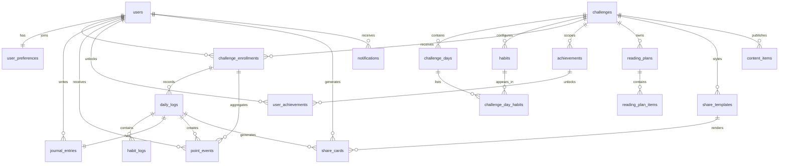

# Banco De Dados

## Modelo inicial

## Tabelas

- `users`
- `user_preferences`
- `challenges`
- `challenge_days`
- `habits`
- `challenge_day_habits`
- `challenge_enrollments`
- `daily_logs`
- `habit_logs`
- `journal_entries`
- `point_events`
- `achievements`
- `user_achievements`
- `reading_plans`
- `reading_plan_items`
- `share_templates`
- `share_cards`
- `content_items`
- `notifications`
- `admin_audit_logs`

## Segurança

RLS está habilitado em todas as tabelas públicas. A política inicial é
conservadora:

- usuários leem apenas os próprios dados;
- diário, logs, pontos, cards e conquistas do usuário são privados;
- desafios ativos, hábitos ativos, plano de leitura publicado, conquistas ativas e
  conteúdo publicado podem ser lidos;
- escritas sensíveis de jornada, pontuação, diário e conquistas ficam reservadas ao
  servidor ou ao administrador;
- administradores usam políticas específicas via `public.is_admin()`.

## Pontuação

`point_events` é o ledger de pontuação. Cada evento tem `idempotency_key` única para
evitar duplicação ao repetir uma finalização ou reprocessamento.
